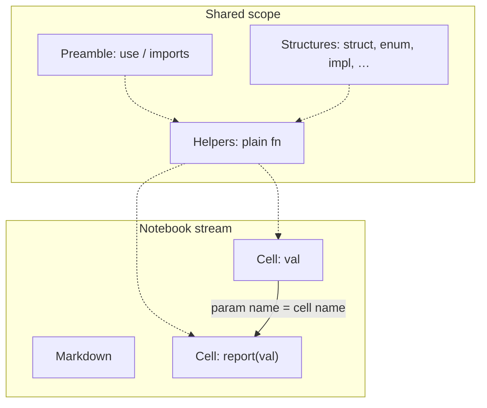

# labrs

Reactive notebook environment for Rust — **real `.rs` files**, not `.ipynb`.

labrs sits in the same space as Pluto / marimo, adapted to Rust: cells are named, typed bindings; the dependency graph is inferred from function parameters; helpers and shared types live in a common compile scope outside the DAG.

### Stack at a glance

- **Source of truth** — a single `.rs` notebook file (parsed with `syn`, pretty-printed with `prettyplease`)
- **Macros** — `#[labrs::cell]`, `#[labrs::helper]`, `#[labrs::markdown]` (passthrough for rust-analyzer)
- **Dependency graph** — edges from cell parameter names; topo-run + dirty / output-hash cascade
- **Execution model** — per-cell temp (or cached) Cargo crate, `cargo run`, JSON return value + captured stdout/stderr
- **Session** — dirty tracking, Auto-run cascade, edit/reload of cells, helpers, structures, and preamble
- **CLI** — `new`, `graph`, `run`, `fmt`, `serve`
- **Web server** — Axum + WebSocket (`labrs-server`)
- **Editor UI** — Monaco (embedded HTML/CSS/JS), Notebook / Shared panes, Inspector + Plan sidebar

## Quick start

```bash
cargo install --path crates/labrs

labrs new hello
labrs graph hello.rs
labrs run hello.rs
labrs serve hello.rs          # http://127.0.0.1:8080
labrs serve hello.rs --no-auto  # manual dirty mode (no cascade)
```

Or from the repo:

```bash
cargo run -p labrs -- serve examples/demo.rs
```

## Mental model: Notebook vs Shared

A labrs notebook is one Rust source file. Items fall into two worlds:

| World | What lives there | Role |
|-------|------------------|------|
| **Notebook** | Markdown + **cells** | Narrative and reactive values. Cells appear in the dependency graph and can be re-run when inputs change. |
| **Shared** | Helpers, structures, preamble | Compile-time shared scope (like a normal Rust module). **Not** in the DAG. Available to every cell when the file is compiled. |



- Edit a **cell** → that binding is dirty; dependents may cascade.
- Edit a **helper / structure / preamble** → the shared universe changed; cells that may depend on it are marked dirty (helpers: referencing cells + dependents; definitions/preamble: all cells).

In the Web UI, **Notebook** and **Shared** are separate panes (tabs, or Detach for side-by-side). Shared has a **Read-only** toggle (on by default).

---

## Item kinds

### Cells — reactive bindings

```rust
#[labrs::cell]
pub fn val() -> u16 {
    4
}

#[labrs::cell]
pub fn report(val: &u16) -> String {
    format!("Double of {val} is {}", double(*val))
}
```

- Attribute: `#[labrs::cell]` on a function.
- **Parameters are dependencies**: each parameter name must match another cell’s name. That builds the DAG edge `dep → this cell`.
- Prefer `&T` for dependencies (injected by reference from upstream outputs).
- Return type is the cell’s published value (JSON-serializable for the UI).
- Cells are **runnable**; their outputs feed downstream cells.

### Helpers — shared functions (not variables)

```rust
fn double(val: u16) -> u16 {
    2 * val
}
```

- Any `fn` **without** `#[labrs::cell]` is a helper (optional `#[labrs::helper]`).
- Compiled into the shared prelude for every cell run.
- **Not** a node in the dependency graph — you call them like normal Rust.
- If you write `fn report(val: &u16)` *with* `#[labrs::cell]` but `val` is not a cell, you get a diagnostic: use a plain `fn` (helper) or create a cell named `val`.

### Markdown — narrative

```rust
#[labrs::markdown]
pub const intro: &str = "# Hello\n\nNotes…";
```

- Shown in the Notebook pane and outlined in the **Plan** sidebar tab.
- Not in the DAG, not executed.

### Definitions — shared structures & preamble

Everything else in the file is a **shared definition**:

| Kind | Examples | UI section |
|------|----------|------------|
| Structures | `struct`, `enum`, `type`, `trait`, `impl`, `const`, `static`, `mod` | Shared → Structures |
| Preamble | `use`, other opaque items | Shared → Preamble (one combined editor) |

These participate in compilation but **not** in the reactive graph.

---

## Dependency graph

Built only from **cells**:

1. For each cell parameter `p`, look for a cell named `p`.
2. If found → edge `p → this_cell` (injection at run time).
3. Soft type check against the upstream return type (prefers reference form).
4. If not found → **error diagnostic** (unbound parameter).

Run order is a **topological sort** of this DAG. Cycles are rejected.

```text
greeting ──► process
val ──► report          (report may call helper double)
my_struct ──► use_my_struct
```

Inspect with:

```bash
labrs graph examples/demo.rs
```

### Reactivity (dirty + cascade)

| Event | Effect |
|-------|--------|
| Edit cell body (had a previous output) | That cell → **dirty** |
| Run cell; output **hash** changed | Direct dependents → **dirty** |
| Auto-run on | Dirty dependents re-run in topo order (Pluto-style cascade) |
| Auto-run off | Dependents stay dirty until you run them |
| Edit helper | Cells whose source mentions the helper (+ dependents) → dirty |
| Edit structure / preamble | All cells → dirty |

Output change detection uses a hash of the serialized return value, so cascading only continues when the upstream value actually changed.

`labrs serve --no-auto` starts with Auto-run off; the toolbar **Auto-run** checkbox toggles the same setting live.

---

## Cell status labels

Each cell card (and the Inspector → Variables list) shows a status badge:

| Badge | Meaning |
|-------|---------|
| **pristine** | Never run successfully in this session (no stored output yet). |
| **running** | Execution in progress (WebSocket `cell_running`; spinner in the UI). |
| **dirty** | Has a previous output, but inputs or shared code changed — output may be stale. |
| **success** | Last run finished successfully; output is considered current. |
| **error** | Last run failed (compile or runtime); see Logs / error panel. |

Priority when several apply: **running** overrides **dirty**, which overrides the last success/error label until the run finishes.

Cards also use a left accent color matching status (teal running, amber dirty, green success, red error).

---

## Execution model

When a cell runs, labrs:

1. Optionally rustfmt’s the notebook.
2. Builds a temporary (or `.labrs/cache`) Cargo crate whose `main` includes:
   - shared **definitions** + **helpers** as prelude,
   - the target cell (and upstream cells as needed for values).
3. Runs `cargo run`, injects dependency values, captures:
   - **Return** — JSON value of the cell’s return type,
   - **Logs** — stdout / stderr,
   - **Error** — compile or panic message if any.
4. Stores the result and value hash for dirty / cascade decisions.

Cells that only need helpers/types still compile against the full shared prelude.

---

## Web UI

```bash
labrs serve notebook.rs
# open http://127.0.0.1:8080
```

### Layout

- **Left sidebar**
  - **Inspector** — Variables (cells + live values), Structures, Preamble, Helpers. Click to jump to the card.
  - **Plan** — outline of markdown sections / headings.
  - Fold sections; hamburger toggles the whole sidebar.
- **Main**
  - **Notebook** — markdown + cells (file order), insert gaps, Run / move / delete.
  - **Shared** — helpers, structures, preamble. **Read-only** checkbox (default on); uncheck to edit and Save.
  - **Detach / Reattach** — Shared beside Notebook with independent scroll and a resize handle.

### Toolbar

- **Auto-run** — cascade dependents when upstream outputs change.
- **Run all** — topo-run every cell.
- **Reload** — re-parse the file from disk.

Monaco editors strip `#[labrs::…]` attributes in the UI and restore them when writing back to the `.rs` file.

---

## CLI reference

| Command | Description |
|---------|-------------|
| `labrs new <name> [--workspace]` | Scaffold a notebook (optional local `Cargo.toml` for rust-analyzer). |
| `labrs graph <file>` | Print cells, helpers, edges, topo order, diagnostics. |
| `labrs run <file> [--no-fmt]` | Format (unless `--no-fmt`) and topo-run all cells. |
| `labrs fmt <file>` | rustfmt the notebook. |
| `labrs serve <file> [--port 8080] [--no-auto]` | Web UI. |

---

## Example

`examples/demo.rs` illustrates the split:

```rust
use labrs::prelude::*;
use serde::{Deserialize, Serialize};

fn double(val: u16) -> u16 { 2 * val }        // helper (Shared)

#[derive(Debug, Serialize, Deserialize)]
struct MyStruct { /* … */ }                     // structure (Shared)

impl MyStruct { /* … */ }                       // structure (Shared)

#[labrs::markdown]
pub const intro: &str = "# labrs example\n…"; // markdown (Notebook)

#[labrs::cell]
pub fn val() -> u16 { 8 }                       // cell

#[labrs::cell]
pub fn report(val: &u16) -> String {            // depends on cell `val`
    let double_val = double(*val);              // calls helper
    format!("Double of {val} is {double_val}")
}
```

- `val` → `report` is a **graph edge**.
- `double` / `MyStruct` are **shared**, not graph nodes.

---

## Workspace layout

```text
crates/
  labrs/           CLI
  labrs-core/      parse, graph, execute, session
  labrs-macros/    #[cell], #[helper], #[markdown]
  labrs-server/    Axum + WebSocket + embedded UI
examples/demo.rs
```

## Design notes

- **File is source of truth** — the UI edits the same `.rs` you open in an editor.
- **Helpers vs cells** — if something shouldn’t be a reactive variable, don’t put `#[labrs::cell]` on it.
- **Attributes are for tooling** — macros are passthrough so rust-analyzer still understands the file; labrs’s parser drives the notebook semantics.
